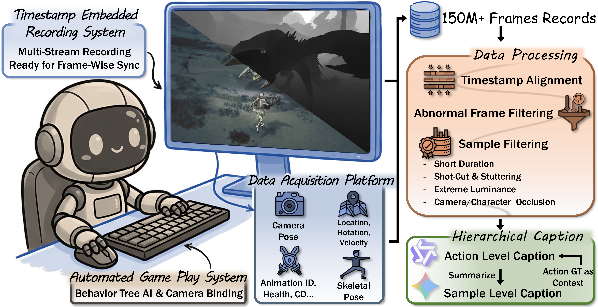

<div align="center">

<h2>WildWorld: A Large-Scale Dataset for Dynamic World Modeling<br>with Actions and Explicit State toward Generative ARPG</h2>

[](https://shandaai.github.io/wildworld-project/)&nbsp;
[](https://arxiv.org/)&nbsp;
[](https://www.youtube.com/watch?v=9vcSg553r2g)&nbsp;

</div>

This repo contains the dataset and benchmark code used in

> [**WildWorld: A Large-Scale Dataset for Dynamic World Modeling with Actions and Explicit State toward Generative ARPG**](https://arxiv.org/)
>
> Zhen Li, Zian Meng, Shuwei Shi, Wenshuo Peng, Yuwei Wu, Bo Zheng, Chuanhao Li, Kaipeng Zhang
>
> 
>
> Alaya Studio, Shanda AI Research Tokyo; Beijing Institute of Technology; Shanghai Innovation Institute

## 🔥Update

- [2026.03.25] We have released our paper — discussions and feedback are warmly welcome!

## 🧠Introduction



**TL;DR** We present **WildWorld**, a large-scale action-conditioned world modeling dataset with explicit state annotations, automatically collected from a photorealistic AAA action role-playing game. It features:

- 🎬 **108M+ frames** with **per-frame annotations**: character skeletons, actions & states (HP, animation, etc.), camera poses, and depth maps
- ⚔️ **450+ semantically meaningful actions** including movement, attacks, and skill casting
- 🐉 **Diverse content**: 29 monster species, 4 player characters, 4 weapon types, 5 distinct stages
- 🕒 **Long-horizon sequences**: clips spanning up to 30+ minutes of continuous gameplay
- 📝 **Hierarchical captions**: both action-level and sample-level natural language descriptions

## 📦TODO

- [ ] Release WildWorld dataset and WildBench benchmark.

## 📄License

See [LICENSE](./LICENSE).

## 📖Citation

If you find this project helpful, please consider citing:

```bibtex
tbd
```
